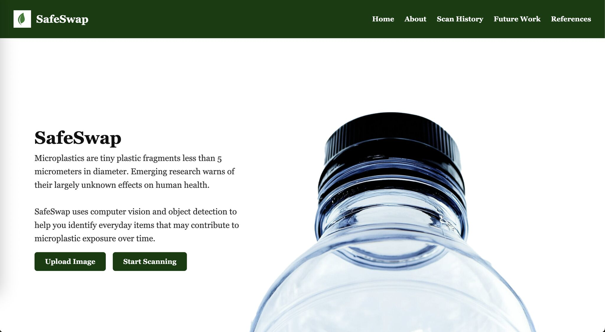
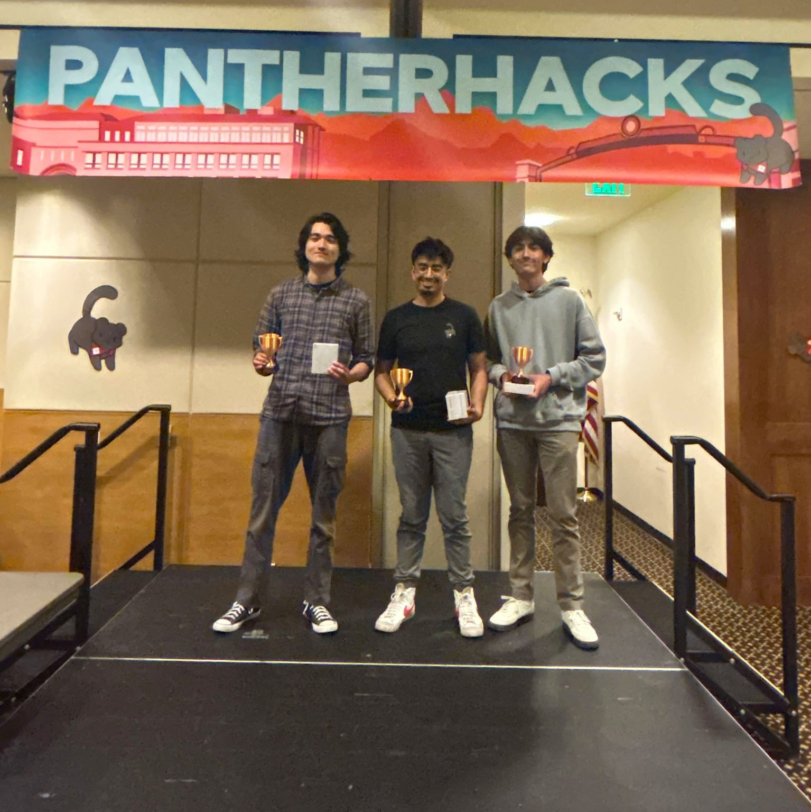
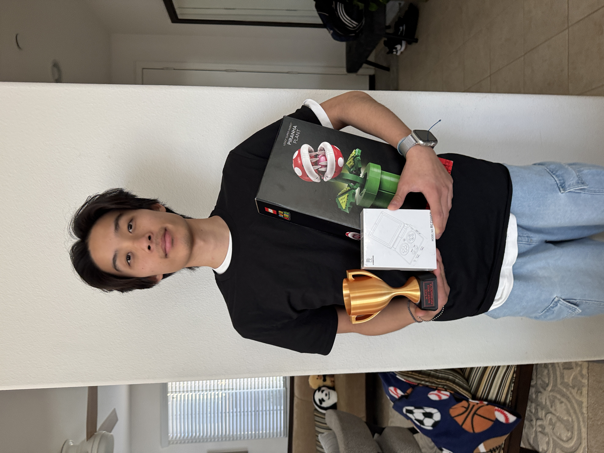

# SafeSwap

[📣 Chapman CS Club PantherHacks Feature](https://www.linkedin.com/posts/chapman-computer-science-club_pantherhacks-pantherhacks2025-hackathon-ugcPost-7322712880305295361-AoyD?utm_source=share&utm_medium=member_desktop&rcm=ACoAAERIrrMBhpriHi6tBcmDMns7PLOnGhRIStE)

SafeSwap is an award-winning interactive web application developed for Chapman University’s 2025 Hackathon. 🏆  
It leverages state-of-the-art computer vision with YOLOv8 to help users detect microplastics in common household items, encouraging sustainable choices and raising awareness about potential health impacts such as dementia.

---

## 🥇 Hackathon Highlights

- 🎉 **Winner of First Place (Most Popular Choice & Sustainability)** at Chapman's Hackathon 2025.
- 🏅 SafeSwap is an interactive web app that helps people detect microplastics in daily items to reduce health risks like dementia and more, using YOLOv8 for computer vision.

  

  
  

🎥 **Live Demo Video:**  
[Watch how SafeSwap works in real time!](https://youtu.be/fTq29E8R6cs)

---

## 🚀 What is SafeSwap?

SafeSwap combines YOLOv8 object detection and a user-friendly web interface to identify everyday household items and estimate their microplastic content. It empowers users to make informed, sustainable choices while raising awareness about hidden microplastic pollution and its potential health impacts.

---

## ⚡️ How to Run It

1. Clone the repository:
   `git clone https://github.com/2fujisawa/safeswap.git`

2. Create and activate your virtual environment:
   `python3 -m venv venv && source venv/bin/activate`

3. Install dependencies:
   `pip install -r requirements.txt`

4. Run the app:
   `python app.py`

5. Click the link in the terminal to open the app in your browser: [http://127.0.0.1:5000](http://127.0.0.1:5000)

---

## 👥 Team Members

This project was built by a dedicated team of 4 people:
- Ewan Shen
- Diego Murillo
- Joaquín Murillo
- Mitsuo Fujisawa
